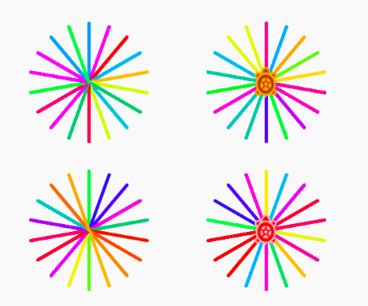

# Randomness

Randomness is used to simulate various phenomena around us. Whether its diffusion of heat in air, or the prices of stock exchange, it's found all around us. It also has application in cryptography. Entropy and chos is very much linked to randomness.

## Random Block turtle Blocks

In turtle Blocks, we have a special block called “random”. Let’s see how this works. Here is a simple code to make

  
Fig 1: Spokes color with "set color" value = 0 

  
Fig 2: The pop-up color wheel shows the numerical value corresponding to different colors which can be given as an input to "set color" block

  
Fig 3: Replacing the fixed numerical value with a random variable which generates any value in the range of 0-90 after each iteration of the for loop creating a multi-color-spoke.

In the above example, we replace the fixed value given as input to set color block with a random variable. The random function generates a new value in every iteration of repeat loop and change the pen color of turtle to different values.

The interesting thing to note here is, the random function has an upper limit and a lower limit which is known as range. The new values are generated inclusive of the range. Here it can generate any value between 0-90 (inclusive of 0 and 90). Also, in this case all the values which are generated is integer.

> 1. Remix the code to generate spoke of random length. As you would have noticed, the turtle has to be brought back to the center before making the turn hence attaching two different random function on both forward and back doesn't work. How will you resolve this challenge ? Share your approach with the community code. Can the range be negative. Why/Why not?
> 2. Here is the output by changing the length of the spoke randomly but with different range values. What can you say about the upper limit and lower limit of the random function in the generated shapes (a-h)?
>  
>Fig 4: Different outputs generated by changing the range of the random function corresponding to the length of the spoke.

---

## How do computer generate random numbers?

spokes generated using seeded pseudorandom generator using Middle-square method-1

spokes generated using seeded pseudorandom generator using Middle-square method-2

using random function

The color wheel in the top rows are generated using the “random function”. The color wheel at the bottom is generated using a function defined by the user implementing the middle-square method algorithm to generate patterns. Seeded-PSRN are really useful for testing applications where you need to keep track of the sequence of random numbers which are generated. This method allows us to generate the same sequence everytime the code is executed. In other words, it's predictable and reproducible. The above is the implementation of a primitive algorithm known as “middle-square method”. These days, computer languages use something more sophisticated known as Wiley algorithm Languages like C, the random function is implemented using such algorithms.
There are two types of random number generators, 
- true random number generators 
- - pseudo-random generators

The true random generator, the system relies on some external physical phenomena which is practically impossible to predict. The time of key stokes presses, the radioactive decay, atmospheric or thermal noise, are some of the phenomenas which are utilised to generate true random numbers.

The pseudo random numbers is not exactly random number but they offeres a lot of benefits, They are predictable and reproducible. Very simply put, there is some seed value which goes into an algorithm and the output serves as the input to generate the next terms. There are ways system generate sequences which are hard to predict and has sufficient randomness for lot of applications. However, in application such as cryptography, for security purpose, PRNG are generally not use. There however is a category of CPRNG which are difficult to hack which using to generate keys etc.

The Not so Random color wheel Middle-Square methods
Can you try to implement the same and share the code.

---

## Random block and square

This is how generally one would code to make a solid and outlined square.

How can you draw a square using "set xy" and the "random block" ?

Here is the video discussing the same,

<iframe src="https://wetube.metastudio.org/CC/player/00:00:14#embed?matchRatio=true" width="640" height="480" frameborder="0" allowfullscreen></iframe>

  
Fig 5: Solid Square

>1. Which parameters will you change to get a rectangle?
>  
>Tinker around with the parameters to generate rectangles of different size.
>
> 2. Can you use "set xy" and "random" block to draw the outlined square as in Fig 6? Share the code with the community. What challenges you faced  ?
>  
>Fig 6: outlined square
> 3. Circle with random number 

---

### Random Walk

Added a Turtle sugarlab code for, ‘Making concentric circles using random numbers’
Single main function.
Using functions/actios. 
There is a bug in this code because ‘less/more than or equal’ condition is missing. Could be resolved using mode
Distribution of count ~ area ( Monte Carlo)

---
